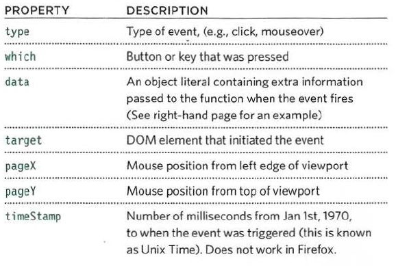

## jQuery

- jQuery: is a javascript file that you include in your web pages it lets you find elements using CSS selectors and do something with the elements using jQuery methods. Is achieve a variety of common JavaScript tasks quickly and consistently.

- we can select object by this `$('ul.ul1')` in this way we can select class for ul.

- How to make code ready to work:

`$(document).ready(function())`
`//script code scope`
`});`

- `.html` : is to decleare element.
- `.text` : is to make text or paragraph (not contain any tags).

- Also we can make design on jQuery like below:

- When a page loads jQuery from a CDN, It starts with a ``

## Events

- Events are the browser's way of indicating when something has happened (such as when a button has been clicked).
- jQuery makes it easier to handle events because the event methods work across all browsers.

**JQUERY EVENTS**

Some of the most popular events that `•on()` deals with are listed below:

* UI: focus , blur, change.
* KEYBOARD: input, keydown, keyup, keypress.
* MOUSE: click, dblclick, mouseup, mousedown,mouseover, mousemove, mouseout, hover.
* FORM: submit, select, change.
* DOCUMENT: ready, load, unload.
* BROWSER: error, resize, scroll.

